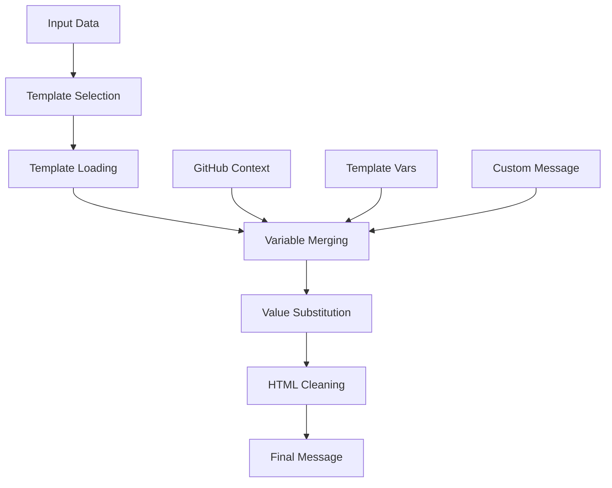

# 🎨 Telegram Notify Action Template System

<!-- Language Navigation -->
<div align="center">

### 🌐 Language / 语言 / Язык

| [🇺🇸 **English**](TEMPLATE-SYSTEM.md) | [🇨🇳 中文](../zh/TEMPLATE-SYSTEM.md) | [🇷🇺 Русский](../ru/TEMPLATE-SYSTEM.md) |
| :----------------------------------: | :---------------------------------: | :------------------------------------: |
|      **Template System Guide**       |          **模板系统指南**           |  **Руководство по системе шаблонов**   |

</div>

---

Complete guide to the templating system for creating dynamic Telegram notifications.

## 📖 Table of Contents

- [Template System Overview](#-template-system-overview)
- [Pre-built Templates](#-pre-built-templates)
- [Variable Syntax](#-variable-syntax)
- [Available Variables](#-available-variables)
- [Multi-language Support](#-multi-language-support)
- [Usage Examples](#-usage-examples)
- [Creating Custom Messages](#-creating-custom-messages)
- [HTML Markup](#-html-markup)
- [Best Practices](#-best-practices)
- [Template Debugging](#-template-debugging)

## 🚀 Template System Overview

The Telegram Notify Action template system enables dynamic message creation with automatic variable substitution. Each template supports:

- **GitHub Context Variables** - automatically available workflow data
- **Custom Variables** - data passed through `template_vars`
- **Multi-language Support** - English, Russian, and Chinese languages
- **HTML Markup** - Telegram-compatible formatting support

### Template Engine Architecture



## 📋 Pre-built Templates

### `success` - Successful Execution

Used for notifications about successful process completion.

**English:**

```html
✅ <b>Success</b>

Repository: {{repository}} Branch: {{refName}} Commit: {{sha}} Actor: {{actor}}
Workflow: {{workflow}} {{customMessage}}
```

### `error` - Execution Error

Used for error and failure notifications.

**English:**

```html
❌ <b>Error</b>

Repository: {{repository}} Branch: {{refName}} Commit: {{sha}} Actor: {{actor}}
Workflow: {{workflow}} Job Status: {{jobStatus}} {{customMessage}}
```

### `warning` - Warning Notice

Used for non-critical warnings.

**English:**

```html
⚠️ <b>Warning</b>

Repository: {{repository}} Branch: {{refName}} Workflow: {{workflow}}
{{customMessage}}
```

### `info` - Information Message

Used for general notifications and information.

**English:**

```html
ℹ️ <b>Information</b>

Repository: {{repository}} Branch: {{refName}} Actor: {{actor}}
{{customMessage}}
```

### `deploy` - Deployment

Used for application deployment notifications.

**English:**

```html
🚀 <b>Deployment</b>

Repository: {{repository}} Branch: {{refName}} Commit: {{sha}} Run:
#{{runNumber}} Deployed by: {{actor}} Status: {{deployStatus}} {{customMessage}}
```

### `test` - Test Results

Used for testing reports.

**English:**

```html
🧪 <b>Test Results</b>

Repository: {{repository}} Branch: {{refName}} Commit: {{sha}} Run:
#{{runNumber}} Test Status: {{testStatus}} Coverage: {{coverage}}
{{customMessage}}
```

### `release` - New Release

Used for new version notifications.

**English:**

```html
🎉 <b>New Release</b>

Repository: {{repository}} Version: {{version}} Tag: {{tag}} Released by:
{{actor}} {{releaseNotes}} {{customMessage}}
```

## 🔧 Variable Syntax

Variables in templates use double curly bracket syntax:

```text
{{variableName}}
```

### Substitution Rules

1. **Variable found** - value is substituted
2. **Variable not found** - remains as is (`{{unknownVar}}`)
3. **Empty value** - empty string is substituted

### Processing Example

**Template:**

```html
Repository: {{repository}} Unknown: {{unknownVariable}} Empty: {{emptyValue}}
```

**Variables:**

```json
{
  "repository": "user/repo",
  "emptyValue": ""
}
```

**Result:**

```html
Repository: user/repo Unknown: {{unknownVariable}} Empty:
```

## 📊 Available Variables

### GitHub Context (automatically available)

| Variable     | Description     | Example                |
| ------------ | --------------- | ---------------------- |
| `repository` | Repository name | `user/awesome-project` |
| `refName`    | Branch/tag name | `main`, `feature/auth` |
| `sha`        | Commit SHA      | `a1b2c3d4e5f6...`      |
| `actor`      | User            | `john-doe`             |
| `workflow`   | Workflow name   | `CI/CD Pipeline`       |
| `job`        | Job name        | `build-and-test`       |
| `runId`      | Workflow run ID | `123456789`            |
| `runNumber`  | Run number      | `42`                   |
| `eventName`  | Trigger event   | `push`, `pull_request` |
| `jobStatus`  | Job status      | `success`, `failure`   |

### URL Variables (automatically available)

Ready-to-use links for inline keyboards and messages:

| Variable          | Description        | Example                                                 |
| ----------------- | ------------------ | ------------------------------------------------------- |
| `workflowUrl`     | Workflow link      | `https://github.com/user/repo/actions/workflows/ci.yml` |
| `runUrl`          | Current run link   | `https://github.com/user/repo/actions/runs/123456`      |
| `commitUrl`       | Commit link        | `https://github.com/user/repo/commit/abc123...`         |
| `compareUrl`      | Compare with base  | `https://github.com/user/repo/compare/main...feature`   |
| `issuesUrl`       | Issues page        | `https://github.com/user/repo/issues`                   |
| `pullRequestsUrl` | Pull requests page | `https://github.com/user/repo/pulls`                    |
| `releasesUrl`     | Releases page      | `https://github.com/user/repo/releases`                 |

### Formatted Variables (automatically available)

| Variable              | Description          | Example                  |
| --------------------- | -------------------- | ------------------------ |
| `shortSha`            | Short SHA (7 chars)  | `abc1234`                |
| `repositoryName`      | Repository name only | `telegram-notify-action` |
| `repositoryOwnerName` | Owner name only      | `asychin`                |

### System Variables (automatically available)

| Variable     | Description         | Example                          |
| ------------ | ------------------- | -------------------------------- |
| `serverUrl`  | GitHub server URL   | `https://github.com`             |
| `workspace`  | Workspace path      | `/home/runner/work/repo`         |
| `runnerOs`   | Runner OS           | `Linux`                          |
| `runnerArch` | Runner architecture | `X64`                            |
| `jobId`      | Current job ID      | `1234567`                        |
| `actionPath` | Action path         | `/home/runner/work/_actions/...` |

### Special Variables

| Variable        | Description                    | Usage           |
| --------------- | ------------------------------ | --------------- |
| `customMessage` | Content of `message` parameter | Additional text |

### Custom Variables

Passed through `template_vars` parameter in JSON format:

```yaml
template_vars: |
  {
    "version": "v2.1.0",
    "environment": "production",
    "deployStatus": "successful",
    "testStatus": "passed",
    "coverage": "95%",
    "duration": "3m 45s"
  }
```

## 🌍 Multi-language Support

### Language Selection

Template language is determined by the `language` parameter:

```yaml
language: en  # English (default)
language: ru  # Русский
language: zh  # 中文
```

### Supported Languages

- **English (`en`)** - complete support for all templates
- **Russian (`ru`)** - complete support for all templates
- **Chinese (`zh`)** - complete support for all templates

### Fallback Mechanism

If a template is not found for the specified language, the English version is used.

## 💡 Usage Examples

### Basic Template Usage

```yaml
- name: Success Notification
  uses: asychin/telegram-notify-action@v3
  with:
    telegram_token: ${{ secrets.TELEGRAM_BOT_TOKEN }}
    chat_id: ${{ secrets.TELEGRAM_CHAT_ID }}
    template: success
    message: "Deployment completed successfully!"
    language: en
```

### Template with Custom Variables

```yaml
- name: Test Results
  uses: asychin/telegram-notify-action@v3
  with:
    telegram_token: ${{ secrets.TELEGRAM_BOT_TOKEN }}
    chat_id: ${{ secrets.TELEGRAM_CHAT_ID }}
    template: test
    message: "All tests passed! 🎉"
    language: en
    template_vars: |
      {
        "testStatus": "✅ All Passed",
        "coverage": "95.8%",
        "duration": "2m 34s",
        "failedTests": "0",
        "totalTests": "127"
      }
```

### Deployment Template with Details

```yaml
- name: Deployment Notification
  uses: asychin/telegram-notify-action@v3
  with:
    telegram_token: ${{ secrets.TELEGRAM_BOT_TOKEN }}
    chat_id: ${{ secrets.TELEGRAM_CHAT_ID }}
    template: deploy
    language: en
    message: |
      🎯 **Deployment Details:**

      - Environment: Production
      - Database migrated: ✅
      - CDN cache cleared: ✅
      - Health check: ✅
    template_vars: |
      {
        "deployStatus": "✅ Successful",
        "version": "${{ github.ref_name }}",
        "environment": "production",
        "deployTime": "3m 45s"
      }
```

### Conditional Template Usage

```yaml
- name: Conditional Template
  uses: asychin/telegram-notify-action@v3
  with:
    telegram_token: ${{ secrets.TELEGRAM_BOT_TOKEN }}
    chat_id: ${{ secrets.TELEGRAM_CHAT_ID }}
    template: ${{ job.status == 'success' && 'success' || 'error' }}
    message: ${{ job.status == 'success' && 'Everything works!' || 'Something went wrong!' }}
    language: en
    template_vars: |
      {
        "status": "${{ job.status }}",
        "conclusion": "${{ job.conclusion }}"
      }
```

### Using URL Variables for Inline Keyboards

```yaml
- name: Enhanced Notification with Links
  uses: asychin/telegram-notify-action@v3
  with:
    telegram_token: ${{ secrets.TELEGRAM_BOT_TOKEN }}
    chat_id: ${{ secrets.TELEGRAM_CHAT_ID }}
    template: success
    message: |
      ✅ **Build Successful!**

      Repository: {{repositoryName}}
      Commit: {{shortSha}} by {{actor}}
      Branch: {{refName}}
    inline_keyboard: |
      [
        {"text": "🔗 View Commit", "url": "${{ github.server_url }}/${{ github.repository }}/commit/${{ github.sha }}"},
        {"text": "📊 View Run", "url": "${{ github.server_url }}/${{ github.repository }}/actions/runs/${{ github.run_id }}"},
        {"text": "🏠 Repository", "url": "${{ github.server_url }}/${{ github.repository }}"}
      ]
```

**Benefits of URL Variables:**

- **Simplified syntax**: `{{runUrl}}` instead of `${{ github.server_url }}/${{ github.repository }}/actions/runs/${{ github.run_id }}`
- **Consistent formatting**: No manual URL construction
- **Ready-to-use**: Available in all templates without additional configuration

> **Note**: URL variables like `{{runUrl}}`, `{{commitUrl}}` work only in **message text**, not in `inline_keyboard`. For inline keyboards, use GitHub Actions variables or pass URLs via `template_vars`.

## 🎨 Creating Custom Messages

### Without Template

```yaml
- name: Custom Message
  uses: asychin/telegram-notify-action@v3
  with:
    telegram_token: ${{ secrets.TELEGRAM_BOT_TOKEN }}
    chat_id: ${{ secrets.TELEGRAM_CHAT_ID }}
    message: |
      🔧 <b>Custom Notification</b>

      Repository: ${{ github.repository }}
      Branch: ${{ github.ref_name }}
      Triggered by: ${{ github.actor }}

      Custom details here...
```

### Combining Template and Custom Message

```yaml
- name: Enhanced Template
  uses: asychin/telegram-notify-action@v3
  with:
    telegram_token: ${{ secrets.TELEGRAM_BOT_TOKEN }}
    chat_id: ${{ secrets.TELEGRAM_CHAT_ID }}
    template: success
    language: en
    message: |
      <b>Deployment Summary:</b>
      - Updated services: 5
      - Downtime: 0 seconds
      - Performance: +15% faster

      <a href="https://app.example.com">🌐 Open Application</a>
    template_vars: |
      {
        "deployStatus": "Zero downtime success"
      }
```

## 📝 HTML Markup

### Supported Tags

Telegram supports a limited set of HTML tags:

| Tag                        | Description        | Example                                   |
| -------------------------- | ------------------ | ----------------------------------------- |
| `<b>`, `<strong>`          | Bold text          | `<b>Important</b>`                        |
| `<i>`, `<em>`              | Italic text        | `<i>Emphasis</i>`                         |
| `<u>`, `<ins>`             | Underlined text    | `<u>Underlined</u>`                       |
| `<s>`, `<strike>`, `<del>` | Strikethrough text | `<s>Deleted</s>`                          |
| `<span>`                   | Container          | `<span class="tg-spoiler">Spoiler</span>` |
| `<tg-spoiler>`             | Spoiler            | `<tg-spoiler>Hidden text</tg-spoiler>`    |
| `<a>`                      | Link               | `<a href="https://example.com">Link</a>`  |
| `<code>`                   | Inline code        | `<code>console.log()</code>`              |
| `<pre>`                    | Code block         | `<pre>function() { ... }</pre>`           |

### Automatic Cleaning

The system automatically removes unsupported tags:

**Input text:**

```html
<div class="container">
  <h1>Title</h1>
  <b>Bold text</b>
  <script>
    alert("hack");
  </script>
</div>
```

**Result:**

```html
Title <b>Bold text</b>
```

### Formatting Examples

```html
🎯 <b>Deployment Status</b>

<i>Environment:</i> <code>production</code> <i>Version:</i>
<code>{{version}}</code> <i>Status:</i> <b>{{deployStatus}}</b>

<a href="https://app.example.com">🌐 Open Application</a>

<pre>
Build Time: {{buildTime}}
Deploy Time: {{deployTime}}
Total Time: {{totalTime}}
</pre>

<tg-spoiler>Secret deployment key: {{secretKey}}</tg-spoiler>
```

## 🏆 Best Practices

### 1. Variable Naming

```yaml
# ✅ Good - descriptive names
template_vars: |
  {
    "deploymentStatus": "successful",
    "buildDuration": "3m 45s",
    "testCoverage": "95.8%"
  }

# ❌ Bad - unclear names
template_vars: |
  {
    "status": "ok",
    "time": "3:45",
    "percent": "95.8"
  }
```

### 2. Message Structure

```yaml
# ✅ Good - clear structure
message: |
  <b>📊 Build Summary</b>

  <i>Status:</i> {{buildStatus}}
  <i>Duration:</i> {{buildDuration}}
  <i>Tests:</i> {{testResults}}

  <b>🚀 Next Steps:</b>
  {{nextSteps}}

# ❌ Bad - unstructured
message: "Build {{buildStatus}} in {{buildDuration}} tests {{testResults}} next {{nextSteps}}"
```

### 3. Error Handling

```yaml
# ✅ Good - condition checking
template_vars: |
  {
    "testStatus": "${{ steps.test.outcome == 'success' && '✅ Passed' || '❌ Failed' }}",
    "coverage": "${{ steps.coverage.outputs.percentage || 'N/A' }}"
  }
```

### 4. Using Emojis

```yaml
# ✅ Good - moderate usage
message: "🎉 Deployment successful! Version {{version}} is now live."

# ❌ Bad - emoji overload
message: "🎉🚀✨🎯 Deployment 🎊🎈 successful! 🌟⭐ Version {{version}} 🎁🎀 is now live! 🔥💯"
```

## 🔍 Template Debugging

### Enable Debug Mode

```yaml
env:
  ACTIONS_STEP_DEBUG: true
```

### Check Variables

```yaml
- name: Debug Template Variables
  run: |
    echo "Repository: ${{ github.repository }}"
    echo "Ref: ${{ github.ref_name }}"
    echo "Actor: ${{ github.actor }}"
    echo "Job Status: ${{ job.status }}"
```

### Test Templates

```yaml
- name: Template Test
  uses: asychin/telegram-notify-action@v3
  with:
    telegram_token: ${{ secrets.TELEGRAM_BOT_TOKEN }}
    chat_id: ${{ secrets.TELEGRAM_CHAT_ID }}
    template: test
    language: en
    message: "Testing template system"
    template_vars: |
      {
        "testMode": true,
        "debugInfo": "Template variable test",
        "timestamp": "${{ github.run_number }}"
      }
```

### JSON Syntax Validation

```bash
# Local JSON validation
echo '{"key": "value", "number": 42}' | jq .

# In GitHub Actions
- name: Validate JSON
  run: |
    cat << 'EOF' | jq .
    {
      "version": "v1.0.0",
      "status": "success"
    }
    EOF
```

## 🚨 Common Errors

### 1. Invalid JSON in template_vars

```yaml
# ❌ Error - unescaped quotes
template_vars: |
  {
    "message": "Hello "world""
  }

# ✅ Fixed
template_vars: |
  {
    "message": "Hello \"world\""
  }
```

### 2. Non-existent Variables

```yaml
# ⚠️ Variable won't be replaced
template: success
message: "Build {{buildNumber}} completed"
# buildNumber not defined in template_vars
```

### 3. Unsupported HTML Tags

```yaml
# ❌ Tags will be removed
message: |
  <div class="alert">
    <h2>Warning</h2>
    <p>This is important</p>
  </div>

# ✅ Supported tags
message: |
  <b>Warning</b>

  This is important
```

## 📚 Additional Resources

- [Main Documentation](README.md)
- [Usage Examples](../../examples/)
- [Telegram Bot API](https://core.telegram.org/bots/api)
- [GitHub Actions Context](https://docs.github.com/en/actions/learn-github-actions/contexts)

---

**🔧 The template system is designed for maximum flexibility and ease of use in GitHub Actions workflows.**
