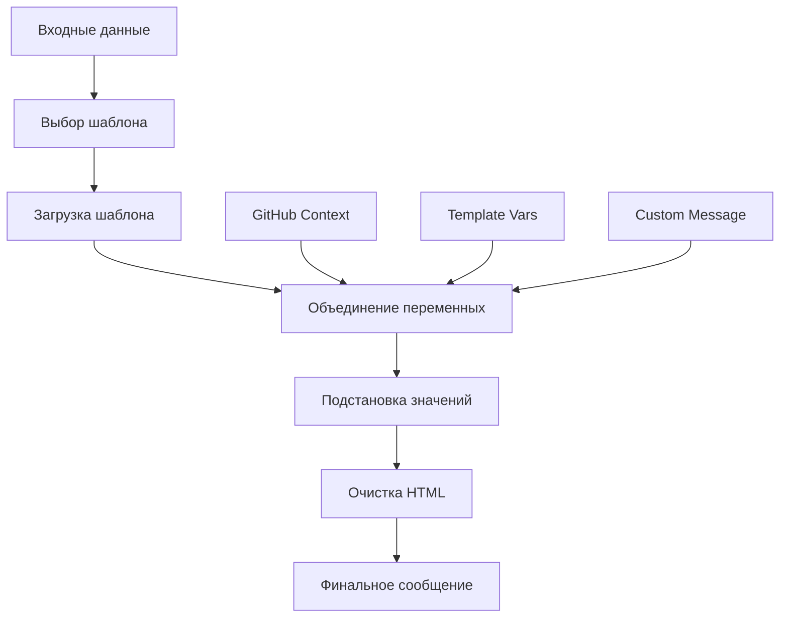

# 🎨 Система шаблонов Telegram Notify Action

<!-- Навигация по языкам -->
<div align="center">

### 🌐 Язык / Language / 语言

| [🇺🇸 English](../en/TEMPLATE-SYSTEM.md) | [🇨🇳 中文](../zh/TEMPLATE-SYSTEM.md) | [🇷🇺 **Русский**](TEMPLATE-SYSTEM.md) |
|:----------------------------------------:|:------------------------------------:|:--------------------------------------:|
| **Template System Guide**               | **模板系统指南**                      | **Руководство по системе шаблонов**    |

</div>

---

Полное руководство по системе шаблонизации для создания динамических уведомлений в Telegram.

## 📖 Оглавление

- [Обзор системы шаблонов](#-обзор-системы-шаблонов)
- [Предустановленные шаблоны](#-предустановленные-шаблоны)
- [Синтаксис переменных](#-синтаксис-переменных)
- [Доступные переменные](#-доступные-переменные)
- [Многоязычность](#-многоязычность)
- [Примеры использования](#-примеры-использования)
- [Создание кастомных сообщений](#-создание-кастомных-сообщений)
- [HTML разметка](#-html-разметка)
- [Лучшие практики](#-лучшие-практики)
- [Отладка шаблонов](#-отладка-шаблонов)

## 🚀 Обзор системы шаблонов

Система шаблонов Telegram Notify Action позволяет создавать динамические сообщения с автоматической подстановкой переменных. Каждый шаблон поддерживает:

- **Переменные GitHub контекста** - автоматически доступные данные о workflow
- **Пользовательские переменные** - данные, передаваемые через `template_vars`
- **Многоязычность** - поддержка русского, английского и китайского языков
- **HTML разметка** - поддержка форматирования, совместимого с Telegram

### Архитектура шаблонизатора



## 📋 Предустановленные шаблоны

### `success` - Успешное выполнение

Используется для уведомлений об успешном завершении процессов.

**Русский:**

```html
✅ <b>Успех</b>

Репозиторий: {{repository}}
Ветка: {{refName}}
Коммит: {{sha}}
Автор: {{actor}}
Workflow: {{workflow}}

{{customMessage}}
```

### `error` - Ошибка выполнения

Используется для уведомлений об ошибках и сбоях.

**Русский:**

```html
❌ <b>Ошибка</b>

Репозиторий: {{repository}}
Ветка: {{refName}}
Коммит: {{sha}}
Автор: {{actor}}
Workflow: {{workflow}}
Статус задачи: {{jobStatus}}

{{customMessage}}
```

### `warning` - Предупреждение

Используется для некритичных предупреждений.

**Русский:**

```html
⚠️ <b>Предупреждение</b>

Репозиторий: {{repository}}
Ветка: {{refName}}
Workflow: {{workflow}}

{{customMessage}}
```

### `info` - Информационное сообщение

Используется для общих уведомлений и информации.

**Русский:**

```html
ℹ️ <b>Информация</b>

Репозиторий: {{repository}}
Ветка: {{refName}}
Автор: {{actor}}

{{customMessage}}
```

### `deploy` - Развертывание

Используется для уведомлений о развертывании приложений.

**Русский:**

```html
🚀 <b>Развертывание</b>

Репозиторий: {{repository}}
Ветка: {{refName}}
Коммит: {{sha}}
Запуск: #{{runNumber}}

Развернул: {{actor}}
Статус: {{deployStatus}}

{{customMessage}}
```

### `test` - Результаты тестов

Используется для отчетов о тестировании.

**Русский:**

```html
🧪 <b>Результаты тестов</b>

Репозиторий: {{repository}}
Ветка: {{refName}}
Коммит: {{sha}}
Запуск: #{{runNumber}}

Статус тестов: {{testStatus}}
Покрытие: {{coverage}}

{{customMessage}}
```

### `release` - Новый релиз

Используется для уведомлений о новых версиях.

**Русский:**

```html
🎉 <b>Новый релиз</b>

Репозиторий: {{repository}}
Версия: {{version}}
Тег: {{tag}}
Выпустил: {{actor}}

{{releaseNotes}}

{{customMessage}}
```

## 🔧 Синтаксис переменных

Переменные в шаблонах используют синтаксис двойных фигурных скобок:

```text
{{имяПеременной}}
```

### Правила подстановки

1. **Найдена переменная** - значение подставляется
2. **Переменная не найдена** - остается как есть (`{{unknownVar}}`)
3. **Пустое значение** - подставляется пустая строка

### Пример обработки

**Шаблон:**

```html
Repository: {{repository}}
Unknown: {{unknownVariable}}
Empty: {{emptyValue}}
```

**Переменные:**

```json
{
  "repository": "user/repo",
  "emptyValue": ""
}
```

**Результат:**

```html
Repository: user/repo
Unknown: {{unknownVariable}}
Empty: 
```

## 📊 Доступные переменные

### GitHub Context (автоматически доступны)

| Переменная   | Описание            | Пример                 |
| ------------ | ------------------- | ---------------------- |
| `repository` | Имя репозитория     | `user/awesome-project` |
| `refName`    | Имя ветки или тега  | `main`, `feature/auth` |
| `sha`        | SHA коммита         | `a1b2c3d4e5f6...`      |
| `actor`      | Пользователь        | `john-doe`             |
| `workflow`   | Имя workflow        | `CI/CD Pipeline`       |
| `job`        | Имя задачи          | `build-and-test`       |
| `runId`      | ID запуска workflow | `123456789`            |
| `runNumber`  | Номер запуска       | `42`                   |
| `eventName`  | Событие-триггер     | `push`, `pull_request` |
| `jobStatus`  | Статус задачи       | `success`, `failure`   |

### Специальные переменные

| Переменная      | Описание                       | Использование        |
| --------------- | ------------------------------ | -------------------- |
| `customMessage` | Содержимое параметра `message` | Дополнительный текст |

### Пользовательские переменные

Передаются через параметр `template_vars` в формате JSON:

```yaml
template_vars: |
  {
    "version": "v2.1.0",
    "environment": "production",
    "deployStatus": "успешно",
    "testStatus": "пройдены",
    "coverage": "95%",
    "duration": "3m 45s"
  }
```

## 🌍 Многоязычность

### Выбор языка

Язык шаблона определяется параметром `language`:

```yaml
language: en  # English
language: ru  # Русский (по умолчанию выше)
language: zh  # 中文
```

### Поддерживаемые языки

- **English (`en`)** - полная поддержка всех шаблонов
- **Русский (`ru`)** - полная поддержка всех шаблонов
- **中文 (`zh`)** - полная поддержка всех шаблонов

### Fallback механизм

Если шаблон не найден для указанного языка, используется английская версия.

## 💡 Примеры использования

### Базовое использование шаблона

```yaml
- name: Уведомление об успехе
  uses: asychin/telegram-notify-action@v2
  with:
    telegram_token: ${{ secrets.TELEGRAM_BOT_TOKEN }}
    chat_id: ${{ secrets.TELEGRAM_CHAT_ID }}
    template: success
    message: "Развертывание завершено успешно!"
    language: ru
```

### Шаблон с пользовательскими переменными

```yaml
- name: Результаты тестов
  uses: asychin/telegram-notify-action@v2
  with:
    telegram_token: ${{ secrets.TELEGRAM_BOT_TOKEN }}
    chat_id: ${{ secrets.TELEGRAM_CHAT_ID }}
    template: test
    message: "Все тесты пройдены! 🎉"
    language: ru
    template_vars: |
      {
        "testStatus": "✅ Все пройдены",
        "coverage": "95.8%",
        "duration": "2m 34s",
        "failedTests": "0",
        "totalTests": "127"
      }
```

### Шаблон развертывания с деталями

```yaml
- name: Уведомление о развертывании
  uses: asychin/telegram-notify-action@v2
  with:
    telegram_token: ${{ secrets.TELEGRAM_BOT_TOKEN }}
    chat_id: ${{ secrets.TELEGRAM_CHAT_ID }}
    template: deploy
    language: ru
    message: |
      🎯 **Детали развертывания:**
      
      - Среда: Продакшн
      - База данных мигрирована: ✅
      - Кеш CDN очищен: ✅
      - Проверка здоровья: ✅
    template_vars: |
      {
        "deployStatus": "✅ Успешно",
        "version": "${{ github.ref_name }}",
        "environment": "production",
        "deployTime": "3m 45s"
      }
```

### Условное использование шаблонов

```yaml
- name: Условный шаблон
  uses: asychin/telegram-notify-action@v2
  with:
    telegram_token: ${{ secrets.TELEGRAM_BOT_TOKEN }}
    chat_id: ${{ secrets.TELEGRAM_CHAT_ID }}
    template: ${{ job.status == 'success' && 'success' || 'error' }}
    message: ${{ job.status == 'success' && 'Всё работает!' || 'Что-то пошло не так!' }}
    language: ru
    template_vars: |
      {
        "status": "${{ job.status }}",
        "conclusion": "${{ job.conclusion }}"
      }
```

## 🎨 Создание кастомных сообщений

### Без шаблона

```yaml
- name: Кастомное сообщение
  uses: asychin/telegram-notify-action@v2
  with:
    telegram_token: ${{ secrets.TELEGRAM_BOT_TOKEN }}
    chat_id: ${{ secrets.TELEGRAM_CHAT_ID }}
    message: |
      🔧 <b>Кастомное уведомление</b>
      
      Репозиторий: ${{ github.repository }}
      Ветка: ${{ github.ref_name }}
      Запустил: ${{ github.actor }}
      
      Кастомные детали здесь...
```

### Комбинирование шаблона и кастомного сообщения

```yaml
- name: Улучшенный шаблон
  uses: asychin/telegram-notify-action@v2
  with:
    telegram_token: ${{ secrets.TELEGRAM_BOT_TOKEN }}
    chat_id: ${{ secrets.TELEGRAM_CHAT_ID }}
    template: success
    language: ru
    message: |
      <b>Сводка развертывания:</b>
      - Обновленных сервисов: 5
      - Время простоя: 0 секунд
      - Производительность: +15% быстрее
      
      <a href="https://app.example.com">🌐 Открыть приложение</a>
    template_vars: |
      {
        "deployStatus": "Успех без простоя"
      }
```

## 📝 HTML разметка

### Поддерживаемые теги

Telegram поддерживает ограниченный набор HTML тегов:

| Тег                        | Описание           | Пример                                    |
| -------------------------- | ------------------ | ----------------------------------------- |
| `<b>`, `<strong>`          | Жирный текст       | `<b>Important</b>`                        |
| `<i>`, `<em>`              | Курсивный текст    | `<i>Emphasis</i>`                         |
| `<u>`, `<ins>`             | Подчеркнутый текст | `<u>Underlined</u>`                       |
| `<s>`, `<strike>`, `<del>` | Зачеркнутый текст  | `<s>Deleted</s>`                          |
| `<span>`                   | Контейнер          | `<span class="tg-spoiler">Spoiler</span>` |
| `<tg-spoiler>`             | Спойлер            | `<tg-spoiler>Hidden text</tg-spoiler>`    |
| `<a>`                      | Ссылка             | `<a href="https://example.com">Link</a>`  |
| `<code>`                   | Встроенный код     | `<code>console.log()</code>`              |
| `<pre>`                    | Блок кода          | `<pre>function() { ... }</pre>`           |

### Автоматическая очистка

Система автоматически удаляет неподдерживаемые теги:

**Входной текст:**

```html
<div class="container">
  <h1>Title</h1>
  <b>Bold text</b>
  <script>
    alert("hack");
  </script>
</div>
```

**Результат:**

```html
Title <b>Bold text</b>
```

### Примеры форматирования

```html
🎯 <b>Статус развертывания</b>

<i>Environment:</i> <code>production</code> <i>Version:</i>
<code>{{version}}</code> <i>Status:</i> <b>{{deployStatus}}</b>

<a href="https://app.example.com">🌐 Открыть приложение</a>

<pre>
Build Time: {{buildTime}}
Deploy Time: {{deployTime}}
Total Time: {{totalTime}}
</pre>

<tg-spoiler>Секретный ключ развертывания: {{secretKey}}</tg-spoiler>
```

## 🏆 Лучшие практики

### 1. Именование переменных

```yaml
# ✅ Хорошо - описательные имена
template_vars: |
  {
    "deploymentStatus": "успешно",
    "buildDuration": "3m 45s",
    "testCoverage": "95.8%"
  }

# ❌ Плохо - неясные имена
template_vars: |
  {
    "status": "ok",
    "time": "3:45",
    "percent": "95.8"
  }
```

### 2. Структурирование сообщений

```yaml
# ✅ Хорошо - четкая структура
message: |
  <b>📊 Сводка сборки</b>
  
  <i>Статус:</i> {{buildStatus}}
  <i>Длительность:</i> {{buildDuration}}
  <i>Тесты:</i> {{testResults}}
  
  <b>🚀 Следующие шаги:</b>
  {{nextSteps}}

# ❌ Плохо - неструктурированно
message: "Сборка {{buildStatus}} за {{buildDuration}} тесты {{testResults}} далее {{nextSteps}}"
```

### 3. Обработка ошибок

```yaml
# ✅ Хорошо - проверка условий
template_vars: |
  {
    "testStatus": "${{ steps.test.outcome == 'success' && '✅ Пройдены' || '❌ Провалены' }}",
    "coverage": "${{ steps.coverage.outputs.percentage || 'N/A' }}"
  }
```

### 4. Использование эмодзи

```yaml
# ✅ Хорошо - умеренное использование
message: "🎉 Развертывание успешно! Версия {{version}} теперь доступна."

# ❌ Плохо - избыток эмодзи
message: "🎉🚀✨🎯 Развертывание 🎊🎈 успешно! 🌟⭐ Версия {{version}} 🎁🎀 теперь доступна! 🔥💯"
```

## 🔍 Отладка шаблонов

### Включение отладки

```yaml
env:
  ACTIONS_STEP_DEBUG: true
```

### Проверка переменных

```yaml
- name: Отладка переменных шаблона
  run: |
    echo "Repository: ${{ github.repository }}"
    echo "Ref: ${{ github.ref_name }}"
    echo "Actor: ${{ github.actor }}"
    echo "Job Status: ${{ job.status }}"
```

### Тестирование шаблонов

```yaml
- name: Тест шаблона
  uses: asychin/telegram-notify-action@v2
  with:
    telegram_token: ${{ secrets.TELEGRAM_BOT_TOKEN }}
    chat_id: ${{ secrets.TELEGRAM_CHAT_ID }}
    template: test
    language: ru
    message: "Тестирование системы шаблонов"
    template_vars: |
      {
        "testMode": true,
        "debugInfo": "Тест переменных шаблона",
        "timestamp": "${{ github.run_number }}"
      }
```

### Проверка JSON синтаксиса

```bash
# Локальная проверка JSON
echo '{"key": "value", "number": 42}' | jq .

# В GitHub Actions
- name: Валидация JSON
  run: |
    cat << 'EOF' | jq .
    {
      "version": "v1.0.0",
      "status": "success"
    }
    EOF
```

## 🚨 Частые ошибки

### 1. Неправильный JSON в template_vars

```yaml
# ❌ Ошибка - неэкранированные кавычки
template_vars: |
  {
    "message": "Hello "world""
  }

# ✅ Исправлено
template_vars: |
  {
    "message": "Hello \"world\""
  }
```

### 2. Несуществующие переменные

```yaml
# ⚠️ Переменная не будет заменена
template: success
message: "Сборка {{buildNumber}} завершена"
# buildNumber не определена в template_vars
```

### 3. Неподдерживаемые HTML теги

```yaml
# ❌ Теги будут удалены
message: |
  <div class="alert">
    <h2>Предупреждение</h2>
    <p>Это важно</p>
  </div>

# ✅ Поддерживаемые теги
message: |
  <b>Предупреждение</b>
  
  Это важно
```

## 📚 Дополнительные ресурсы

- [Основная документация](README.md)
- [Примеры использования](../../examples/)
- [Telegram Bot API](https://core.telegram.org/bots/api)
- [GitHub Actions Context](https://docs.github.com/en/actions/learn-github-actions/contexts)

---

**🔧 Система шаблонов разработана для максимальной гибкости и удобства использования в GitHub Actions workflows.**