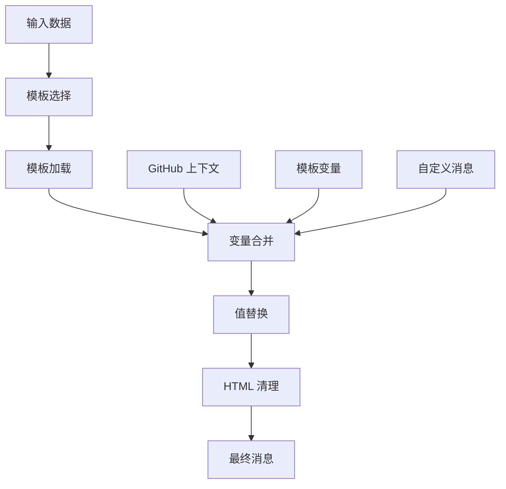

# 🎨 Telegram Notify Action 模板系统

<!-- 语言导航 -->
<div align="center">

### 🌐 语言 / Language / Язык

| [🇺🇸 English](../en/TEMPLATE-SYSTEM.md) | [🇨🇳 **中文**](TEMPLATE-SYSTEM.md) | [🇷🇺 Русский](../ru/TEMPLATE-SYSTEM.md) |
| :------------------------------------: | :-------------------------------: | :------------------------------------: |
|       **Template System Guide**        |         **模板系统指南**          |  **Руководство по системе шаблонов**   |

</div>

---

用于创建动态 Telegram 通知的模板系统完整指南。

## 📖 目录

- [模板系统概述](#-模板系统概述)
- [预构建模板](#-预构建模板)
- [变量语法](#-变量语法)
- [可用变量](#-可用变量)
- [多语言支持](#-多语言支持)
- [使用示例](#-使用示例)
- [创建自定义消息](#-创建自定义消息)
- [HTML 标记](#-html-标记)
- [最佳实践](#-最佳实践)
- [模板调试](#-模板调试)

## 🚀 模板系统概述

Telegram Notify Action 模板系统支持通过自动变量替换创建动态消息。每个模板支持：

- **GitHub 上下文变量** - 自动可用的工作流数据
- **自定义变量** - 通过 `template_vars` 传递的数据
- **多语言支持** - 中文、英文和俄文
- **HTML 标记** - Telegram 兼容的格式化支持

### 模板引擎架构



## 📋 预构建模板

### `success` - 成功执行

用于成功完成流程的通知。

**中文：**

```html
✅ <b>成功</b>

仓库: {{repository}} 分支: {{refName}} 提交: {{sha}} 执行者: {{actor}} 工作流:
{{workflow}} {{customMessage}}
```

### `error` - 执行错误

用于错误和失败通知。

**中文：**

```html
❌ <b>错误</b>

仓库: {{repository}} 分支: {{refName}} 提交: {{sha}} 执行者: {{actor}} 工作流:
{{workflow}} 任务状态: {{jobStatus}} {{customMessage}}
```

### `warning` - 警告通知

用于非关键警告。

**中文：**

```html
⚠️ <b>警告</b>

仓库: {{repository}} 分支: {{refName}} 工作流: {{workflow}} {{customMessage}}
```

### `info` - 信息消息

用于一般通知和信息。

**中文：**

```html
ℹ️ <b>信息</b>

仓库: {{repository}} 分支: {{refName}} 执行者: {{actor}} {{customMessage}}
```

### `deploy` - 部署

用于应用程序部署通知。

**中文：**

```html
🚀 <b>部署</b>

仓库: {{repository}} 分支: {{refName}} 提交: {{sha}} 运行: #{{runNumber}}
部署者: {{actor}} 状态: {{deployStatus}} {{customMessage}}
```

### `test` - 测试结果

用于测试报告。

**中文：**

```html
🧪 <b>测试结果</b>

仓库: {{repository}} 分支: {{refName}} 提交: {{sha}} 运行: #{{runNumber}}
测试状态: {{testStatus}} 覆盖率: {{coverage}} {{customMessage}}
```

### `release` - 新版本发布

用于新版本发布通知。

**中文：**

```html
🎉 <b>新版本发布</b>

仓库: {{repository}} 版本: {{version}} 标签: {{tag}} 发布者: {{actor}}
{{releaseNotes}} {{customMessage}}
```

## 🔧 变量语法

模板中的变量使用双花括号语法：

```text
{{变量名}}
```

### 替换规则

1. **找到变量** - 替换为值
2. **未找到变量** - 保持原样 (`{{unknownVar}}`)
3. **空值** - 替换为空字符串

### 处理示例

**模板：**

```html
仓库: {{repository}} 未知: {{unknownVariable}} 空值: {{emptyValue}}
```

**变量：**

```json
{
  "repository": "user/repo",
  "emptyValue": ""
}
```

**结果：**

```html
仓库: user/repo 未知: {{unknownVariable}} 空值:
```

## 📊 可用变量

### GitHub 上下文（自动可用）

#### 基础 GitHub 变量

| 变量         | 描述          | 示例                   |
| ------------ | ------------- | ---------------------- |
| `repository` | 仓库名称      | `user/awesome-project` |
| `refName`    | 分支/标签名称 | `main`, `feature/auth` |
| `sha`        | 提交 SHA      | `a1b2c3d4e5f6...`      |
| `actor`      | 用户          | `john-doe`             |
| `workflow`   | 工作流名称    | `CI/CD Pipeline`       |
| `job`        | 作业名称      | `build-and-test`       |
| `runId`      | 工作流运行 ID | `123456789`            |
| `runNumber`  | 运行编号      | `42`                   |
| `eventName`  | 触发事件      | `push`, `pull_request` |
| `jobStatus`  | 作业状态      | `success`, `failure`   |

#### 扩展 GitHub 变量

| 变量                | 描述           | 示例                 |
| ------------------- | -------------- | -------------------- |
| `repositoryOwner`   | 仓库所有者     | `asychin`            |
| `repositoryId`      | 仓库 ID        | `123456789`          |
| `repositoryOwnerId` | 仓库所有者 ID  | `987654321`          |
| `ref`               | 完整引用       | `refs/heads/main`    |
| `refType`           | 引用类型       | `branch`, `tag`      |
| `refProtected`      | 引用是否受保护 | `true`, `false`      |
| `baseRef`           | 基础引用       | `refs/heads/main`    |
| `headRef`           | Head 引用      | `refs/heads/feature` |
| `triggeredBy`       | 触发者         | `john-doe`           |
| `actorId`           | 执行者 ID      | `123456`             |
| `runAttempt`        | 运行尝试次数   | `1`, `2`             |

### URL 变量（自动可用）

用于内联键盘和消息的现成链接：

| 变量              | 描述           | 示例                                                    |
| ----------------- | -------------- | ------------------------------------------------------- |
| `workflowUrl`     | 工作流链接     | `https://github.com/user/repo/actions/workflows/ci.yml` |
| `runUrl`          | 当前运行链接   | `https://github.com/user/repo/actions/runs/123456`      |
| `commitUrl`       | 提交链接       | `https://github.com/user/repo/commit/abc123...`         |
| `compareUrl`      | 与基础分支比较 | `https://github.com/user/repo/compare/main...feature`   |
| `issuesUrl`       | Issues 页面    | `https://github.com/user/repo/issues`                   |
| `pullRequestsUrl` | PR 页面        | `https://github.com/user/repo/pulls`                    |
| `releasesUrl`     | 发布页面       | `https://github.com/user/repo/releases`                 |

### 格式化变量（自动可用）

| 变量                  | 描述                 | 示例                     |
| --------------------- | -------------------- | ------------------------ |
| `shortSha`            | 短 SHA（7 字符）     | `abc1234`                |
| `repositoryName`      | 仓库名称（仅名称）   | `telegram-notify-action` |
| `repositoryOwnerName` | 所有者名称（仅名称） | `asychin`                |

### 系统变量（自动可用）

#### GitHub API 和环境

| 变量               | 描述               | 示例                             |
| ------------------ | ------------------ | -------------------------------- |
| `serverUrl`        | GitHub 服务器 URL  | `https://github.com`             |
| `apiUrl`           | GitHub API URL     | `https://api.github.com`         |
| `graphqlUrl`       | GitHub GraphQL URL | `https://api.github.com/graphql` |
| `workspace`        | 工作空间路径       | `/home/runner/work/repo`         |
| `eventPath`        | 事件数据文件路径   | `/github/workflow/event.json`    |
| `jobId`            | 当前作业 ID        | `1234567`                        |
| `actionRef`        | Action 引用        | `main`                           |
| `actionRepository` | Action 仓库        | `actions/checkout`               |
| `workflowRef`      | 工作流引用         | `refs/heads/main`                |
| `workflowSha`      | 工作流 SHA         | `abc123...`                      |
| `retentionDays`    | 构件保留天数       | `90`                             |
| `secretSource`     | 密钥源             | `Actions`                        |
| `actionPath`       | Action 路径        | `/home/runner/work/_actions/...` |
| `stepSummary`      | 步骤摘要文件路径   | `/github/step_summary`           |
| `envPath`          | 环境文件路径       | `/github/env`                    |
| `path`             | PATH 环境变量      | `/usr/bin:/bin`                  |

#### 运行器环境

| 变量                | 描述               | 示例                           |
| ------------------- | ------------------ | ------------------------------ |
| `runnerOs`          | 运行器操作系统     | `Linux`, `Windows`, `macOS`    |
| `runnerArch`        | 运行器架构         | `X64`, `ARM64`                 |
| `runnerName`        | 运行器机器名称     | `GitHub Actions 2`             |
| `runnerEnvironment` | 运行器环境类型     | `github-hosted`, `self-hosted` |
| `runnerTemp`        | 运行器临时目录     | `/tmp`                         |
| `runnerToolCache`   | 运行器工具缓存目录 | `/opt/hostedtoolcache`         |
| `runnerDebug`       | 是否启用调试模式   | `1`, `0`                       |
| `ci`                | CI 环境指示器      | `true`                         |

### 事件上下文变量（v3 新增）

基于 GitHub 事件类型自动提取的变量：

#### 通用事件变量（所有事件）

| 变量            | 描述        | 示例               |
| --------------- | ----------- | ------------------ |
| `triggerUser`   | 触发用户    | `john-doe`         |
| `triggerUserId` | 触发用户 ID | `123456`           |
| `action`        | 事件动作    | `opened`, `closed` |

#### Issues 事件

| 变量          | 描述               | 示例                   |
| ------------- | ------------------ | ---------------------- |
| `author`      | Issue 作者         | `john-doe`             |
| `issueNumber` | Issue 编号         | `42`                   |
| `issueTitle`  | Issue 标题         | `登录系统中的错误`     |
| `issueState`  | Issue 状态         | `open`, `closed`       |
| `issueBody`   | Issue 描述         | `描述文本...`          |
| `labels`      | 标签（逗号分隔）   | `bug, frontend`        |
| `assignees`   | 指派者（逗号分隔） | `user1, user2`         |
| `createdAt`   | 创建日期           | `2024-01-15T10:30:00Z` |
| `updatedAt`   | 最后更新日期       | `2024-01-16T14:20:00Z` |

#### Issue 评论事件

| 变量               | 描述         | 示例                   |
| ------------------ | ------------ | ---------------------- |
| `author`           | Issue 作者   | `john-doe`             |
| `issueNumber`      | Issue 编号   | `42`                   |
| `issueTitle`       | Issue 标题   | `登录系统中的错误`     |
| `issueState`       | Issue 状态   | `open`, `closed`       |
| `commentAuthor`    | 评论作者     | `jane-doe`             |
| `commentBody`      | 评论文本     | `看起来不错！`         |
| `commentId`        | 评论 ID      | `987654321`            |
| `commentCreatedAt` | 评论创建日期 | `2024-01-15T11:30:00Z` |

#### Pull Request 事件

| 变量          | 描述               | 示例                     |
| ------------- | ------------------ | ------------------------ |
| `author`      | PR 作者            | `jane-doe`               |
| `prNumber`    | Pull Request 编号  | `123`                    |
| `prTitle`     | Pull Request 标题  | `添加新功能`             |
| `prState`     | Pull Request 状态  | `open`, `merged`         |
| `prBody`      | Pull Request 描述  | `此 PR 添加...`          |
| `prUrl`       | Pull Request URL   | `https://github.com/...` |
| `baseBranch`  | 目标分支           | `main`                   |
| `headBranch`  | 源分支             | `feature/auth`           |
| `prCreatedAt` | PR 创建日期        | `2024-01-15T10:30:00Z`   |
| `prUpdatedAt` | PR 最后更新日期    | `2024-01-16T14:20:00Z`   |
| `isDraft`     | 是否为草稿 PR      | `true`, `false`          |
| `mergeable`   | 是否可合并         | `true`, `false`          |
| `labels`      | 标签（逗号分隔）   | `enhancement, frontend`  |
| `assignees`   | 指派者（逗号分隔） | `user1, user2`           |

#### Pull Request 审查事件

| 变量           | 描述              | 示例                            |
| -------------- | ----------------- | ------------------------------- |
| `author`       | PR 作者           | `jane-doe`                      |
| `prNumber`     | Pull Request 编号 | `123`                           |
| `prTitle`      | Pull Request 标题 | `添加新功能`                    |
| `prUrl`        | Pull Request URL  | `https://github.com/...`        |
| `reviewAuthor` | 审查作者          | `maintainer`                    |
| `reviewState`  | 审查状态          | `approved`, `changes_requested` |
| `reviewBody`   | 审查评论          | `看起来不错！`                  |
| `reviewId`     | 审查 ID           | `987654321`                     |

#### Push 事件

| 变量                | 描述         | 示例           |
| ------------------- | ------------ | -------------- |
| `pusher`            | 推送用户     | `dev-user`     |
| `pusherId`          | 推送用户 ID  | `123456`       |
| `commitCount`       | 提交数量     | `3`            |
| `lastCommitMessage` | 最后提交消息 | `修复身份验证` |
| `lastCommitAuthor`  | 最后提交作者 | `dev-user`     |
| `lastCommitId`      | 最后提交 ID  | `a1b2c3d...`   |

#### Release 事件

| 变量               | 描述         | 示例                   |
| ------------------ | ------------ | ---------------------- |
| `releaseAuthor`    | 发布作者     | `maintainer`           |
| `releaseName`      | 发布名称     | `v2.1.0`               |
| `releaseTag`       | 发布标签     | `v2.1.0`               |
| `releaseBody`      | 发布说明     | `新功能...`            |
| `releaseCreatedAt` | 创建日期     | `2024-01-15T10:30:00Z` |
| `isPrerelease`     | 是否为预发布 | `true`, `false`        |
| `isDraft`          | 是否为草稿   | `true`, `false`        |

#### Workflow Run 事件

| 变量                 | 描述           | 示例                       |
| -------------------- | -------------- | -------------------------- |
| `workflowName`       | 工作流名称     | `CI Pipeline`              |
| `workflowStatus`     | 工作流状态     | `completed`, `in_progress` |
| `workflowConclusion` | 工作流结论     | `success`, `failure`       |
| `workflowId`         | 工作流 ID      | `123456789`                |
| `workflowRunNumber`  | 工作流运行编号 | `42`                       |
| `workflowActor`      | 工作流执行者   | `john-doe`                 |

#### Deployment 事件

| 变量                    | 描述       | 示例                    |
| ----------------------- | ---------- | ----------------------- |
| `deploymentId`          | 部署 ID    | `123456789`             |
| `deploymentEnvironment` | 部署环境   | `production`, `staging` |
| `deploymentRef`         | 部署引用   | `refs/heads/main`       |
| `deploymentSha`         | 部署 SHA   | `abc123...`             |
| `deploymentCreator`     | 部署创建者 | `deploy-bot`            |

#### Deployment Status 事件

| 变量                       | 描述     | 示例                      |
| -------------------------- | -------- | ------------------------- |
| `deploymentState`          | 部署状态 | `success`, `failure`      |
| `deploymentDescription`    | 部署描述 | `部署成功`                |
| `deploymentEnvironmentUrl` | 环境 URL | `https://staging.app.com` |
| `deploymentEnvironment`    | 部署环境 | `production`, `staging`   |

> **注意**：事件上下文变量基于触发事件自动可用 - 无需手动配置！

### 特殊变量

| 变量            | 描述                 | 使用     |
| --------------- | -------------------- | -------- |
| `customMessage` | `message` 参数的内容 | 附加文本 |

### 自定义变量

通过 `template_vars` 参数以 JSON 格式传递：

```yaml
template_vars: |
  {
    "version": "v2.1.0",
    "environment": "production",
    "deployStatus": "成功",
    "testStatus": "通过",
    "coverage": "95%",
    "duration": "3分45秒"
  }
```

## 🌍 多语言支持

### 语言选择

模板语言由 `language` 参数确定：

```yaml
language: en  # English
language: ru  # Русский
language: zh  # 中文（默认如上）
```

### 支持的语言

- **English (`en`)** - 所有模板的完整支持
- **Russian (`ru`)** - 所有模板的完整支持
- **中文 (`zh`)** - 所有模板的完整支持

### 回退机制

如果指定语言的模板未找到，将使用英文版本。

## 💡 使用示例

### 基本模板使用

```yaml
- name: 成功通知
  uses: asychin/telegram-notify-action@v3
  with:
    telegram_token: ${{ secrets.TELEGRAM_BOT_TOKEN }}
    chat_id: ${{ secrets.TELEGRAM_CHAT_ID }}
    template: success
    message: "部署成功完成！"
    language: zh
```

### 带自定义变量的模板

```yaml
- name: 测试结果
  uses: asychin/telegram-notify-action@v3
  with:
    telegram_token: ${{ secrets.TELEGRAM_BOT_TOKEN }}
    chat_id: ${{ secrets.TELEGRAM_CHAT_ID }}
    template: test
    message: "所有测试通过！🎉"
    language: zh
    template_vars: |
      {
        "testStatus": "✅ 全部通过",
        "coverage": "95.8%",
        "duration": "2分34秒",
        "failedTests": "0",
        "totalTests": "127"
      }
```

### 带详细信息的部署模板

```yaml
- name: 部署通知
  uses: asychin/telegram-notify-action@v3
  with:
    telegram_token: ${{ secrets.TELEGRAM_BOT_TOKEN }}
    chat_id: ${{ secrets.TELEGRAM_CHAT_ID }}
    template: deploy
    language: zh
    message: |
      🎯 **部署详情：**

      - 环境：生产环境
      - 数据库已迁移：✅
      - CDN 缓存已清理：✅
      - 健康检查：✅
    template_vars: |
      {
        "deployStatus": "✅ 成功",
        "version": "${{ github.ref_name }}",
        "environment": "生产环境",
        "deployTime": "3分45秒"
      }
```

### 条件模板使用

```yaml
- name: 条件模板
  uses: asychin/telegram-notify-action@v3
  with:
    telegram_token: ${{ secrets.TELEGRAM_BOT_TOKEN }}
    chat_id: ${{ secrets.TELEGRAM_CHAT_ID }}
    template: ${{ job.status == 'success' && 'success' || 'error' }}
    message: ${{ job.status == 'success' && '一切正常！' || '出现问题了！' }}
    language: zh
    template_vars: |
      {
        "status": "${{ job.status }}",
        "conclusion": "${{ job.conclusion }}"
      }
```

### 使用 URL 变量创建内联键盘

```yaml
- name: 带链接的增强通知
  uses: asychin/telegram-notify-action@v3
  with:
    telegram_token: ${{ secrets.TELEGRAM_BOT_TOKEN }}
    chat_id: ${{ secrets.TELEGRAM_CHAT_ID }}
    template: success
    message: |
      ✅ **构建成功！**

      仓库：{{repositoryName}}
      提交：{{shortSha}} 由 {{actor}}
      分支：{{refName}}
    inline_keyboard: |
      [
        {"text": "🔗 查看提交", "url": "${{ github.server_url }}/${{ github.repository }}/commit/${{ github.sha }}"},
        {"text": "📊 查看运行", "url": "${{ github.server_url }}/${{ github.repository }}/actions/runs/${{ github.run_id }}"},
        {"text": "🏠 仓库", "url": "${{ github.server_url }}/${{ github.repository }}"}
      ]
```

**URL 变量的优势：**

- **简化语法**：使用 `{{runUrl}}` 而不是 `${{ github.server_url }}/${{ github.repository }}/actions/runs/${{ github.run_id }}`
- **一致格式**：无需手动构建 URL
- **即用即得**：在所有模板中可用，无需额外配置

> **注意**：URL 变量如 `{{runUrl}}`、`{{commitUrl}}` 仅在**消息文本**中有效，不适用于 `inline_keyboard`。对于内联键盘，请使用 GitHub Actions 变量或通过 `template_vars` 传递 URL。

## 🎨 创建自定义消息

### 不使用模板

```yaml
- name: 自定义消息
  uses: asychin/telegram-notify-action@v3
  with:
    telegram_token: ${{ secrets.TELEGRAM_BOT_TOKEN }}
    chat_id: ${{ secrets.TELEGRAM_CHAT_ID }}
    message: |
      🔧 <b>自定义通知</b>

      仓库：${{ github.repository }}
      分支：${{ github.ref_name }}
      触发者：${{ github.actor }}

      这里是自定义详情...
```

### 结合模板和自定义消息

```yaml
- name: 增强模板
  uses: asychin/telegram-notify-action@v3
  with:
    telegram_token: ${{ secrets.TELEGRAM_BOT_TOKEN }}
    chat_id: ${{ secrets.TELEGRAM_CHAT_ID }}
    template: success
    language: zh
    message: |
      <b>部署摘要：</b>
      - 更新的服务：5个
      - 停机时间：0秒
      - 性能提升：+15%

      <a href="https://app.example.com">🌐 打开应用</a>
    template_vars: |
      {
        "deployStatus": "零停机成功"
      }
```

## 📝 HTML 标记

### 支持的标签

Telegram 支持有限的 HTML 标签集：

| 标签                       | 描述     | 示例                                     |
| -------------------------- | -------- | ---------------------------------------- |
| `<b>`, `<strong>`          | 粗体文本 | `<b>重要</b>`                            |
| `<i>`, `<em>`              | 斜体文本 | `<i>强调</i>`                            |
| `<u>`, `<ins>`             | 下划线   | `<u>下划线</u>`                          |
| `<s>`, `<strike>`, `<del>` | 删除线   | `<s>已删除</s>`                          |
| `<span>`                   | 容器     | `<span class="tg-spoiler">剧透</span>`   |
| `<tg-spoiler>`             | 剧透     | `<tg-spoiler>隐藏文本</tg-spoiler>`      |
| `<a>`                      | 链接     | `<a href="https://example.com">链接</a>` |
| `<code>`                   | 内联代码 | `<code>console.log()</code>`             |
| `<pre>`                    | 代码块   | `<pre>function() { ... }</pre>`          |

### 自动清理

系统自动删除不支持的标签：

**输入文本：**

```html
<div class="container">
  <h1>标题</h1>
  <b>粗体文本</b>
  <script>
    alert("hack");
  </script>
</div>
```

**结果：**

```html
标题 <b>粗体文本</b>
```

### 格式化示例

```html
🎯 <b>部署状态</b>

<i>环境：</i> <code>production</code> <i>版本：</i> <code>{{version}}</code>
<i>状态：</i> <b>{{deployStatus}}</b>

<a href="https://app.example.com">🌐 打开应用</a>

<pre>
构建时间：{{buildTime}}
部署时间：{{deployTime}}
总时间：{{totalTime}}
</pre>

<tg-spoiler>秘密部署密钥：{{secretKey}}</tg-spoiler>
```

## 🏆 最佳实践

### 1. 变量命名

```yaml
# ✅ 好 - 描述性名称
template_vars: |
  {
    "deploymentStatus": "成功",
    "buildDuration": "3分45秒",
    "testCoverage": "95.8%"
  }

# ❌ 差 - 不清楚的名称
template_vars: |
  {
    "status": "ok",
    "time": "3:45",
    "percent": "95.8"
  }
```

### 2. 消息结构

```yaml
# ✅ 好 - 清晰的结构
message: |
  <b>📊 构建摘要</b>

  <i>状态：</i> {{buildStatus}}
  <i>持续时间：</i> {{buildDuration}}
  <i>测试：</i> {{testResults}}

  <b>🚀 下一步：</b>
  {{nextSteps}}

# ❌ 差 - 无结构
message: "构建 {{buildStatus}} 耗时 {{buildDuration}} 测试 {{testResults}} 下一步 {{nextSteps}}"
```

### 3. 错误处理

```yaml
# ✅ 好 - 条件检查
template_vars: |
  {
    "testStatus": "${{ steps.test.outcome == 'success' && '✅ 通过' || '❌ 失败' }}",
    "coverage": "${{ steps.coverage.outputs.percentage || '不适用' }}"
  }
```

### 4. 使用表情符号

```yaml
# ✅ 好 - 适度使用
message: "🎉 部署成功！版本 {{version}} 现已上线。"

# ❌ 差 - 过度使用表情符号
message: "🎉🚀✨🎯 部署 🎊🎈 成功！🌟⭐ 版本 {{version}} 🎁🎀 现已上线！🔥💯"
```

## 🔍 模板调试

### 启用调试模式

```yaml
env:
  ACTIONS_STEP_DEBUG: true
```

### 检查变量

```yaml
- name: 调试模板变量
  run: |
    echo "仓库：${{ github.repository }}"
    echo "引用：${{ github.ref_name }}"
    echo "执行者：${{ github.actor }}"
    echo "作业状态：${{ job.status }}"
```

### 测试模板

```yaml
- name: 模板测试
  uses: asychin/telegram-notify-action@v3
  with:
    telegram_token: ${{ secrets.TELEGRAM_BOT_TOKEN }}
    chat_id: ${{ secrets.TELEGRAM_CHAT_ID }}
    template: test
    language: zh
    message: "测试模板系统"
    template_vars: |
      {
        "testMode": true,
        "debugInfo": "模板变量测试",
        "timestamp": "${{ github.run_number }}"
      }
```

### JSON 语法验证

```bash
# 本地 JSON 验证
echo '{"key": "value", "number": 42}' | jq .

# 在 GitHub Actions 中
- name: 验证 JSON
  run: |
    cat << 'EOF' | jq .
    {
      "version": "v1.0.0",
      "status": "success"
    }
    EOF
```

## 🚨 常见错误

### 1. template_vars 中的无效 JSON

```yaml
# ❌ 错误 - 未转义的引号
template_vars: |
  {
    "message": "Hello "world""
  }

# ✅ 修复
template_vars: |
  {
    "message": "Hello \"world\""
  }
```

### 2. 不存在的变量

```yaml
# ⚠️ 变量不会被替换
template: success
message: "构建 {{buildNumber}} 完成"
# buildNumber 未在 template_vars 中定义
```

### 3. template_vars 中的 HTML 内容

在 `template_vars` 中包含 HTML 内容时，务必使用正确的 JSON 转义：

```yaml
# ❌ 错误 - HTML 中的未转义引号破坏了 JSON
template_vars: |
  {
    "buildReport": "<div class="status">成功</div>"
  }

# ✅ 修复 - 正确的 JSON 转义
template_vars: |
  {
    "buildReport": "<div class=\"status\">成功</div>"
  }

# ✅ 最佳实践 - 在工作流中使用 JSON.stringify
template_vars: ${{ toJson({
  buildReport: '<div class="status">成功</div>',
  duration: '2分30秒'
}) }}
```

**💡 提示：** 从 GitHub Actions 传递 HTML 时，使用 `toJson()` 函数进行自动转义：

```yaml
- name: 生成构建报告
  id: report
  run: |
    echo "html=<b>状态:</b> ✅ 成功<br/><b>持续时间:</b> 2分30秒" >> $GITHUB_OUTPUT

- name: 发送通知
  uses: asychin/telegram-notify-action@v3
  with:
    telegram_token: ${{ secrets.TELEGRAM_BOT_TOKEN }}
    chat_id: ${{ secrets.TELEGRAM_CHAT_ID }}
    message: "构建完成: {{buildReport}}"
    template_vars: ${{ toJson({
      buildReport: steps.report.outputs.html
    }) }}
```

### 4. 不支持的 HTML 标签

```yaml
# ❌ 标签将被删除
message: |
  <div class="alert">
    <h2>警告</h2>
    <p>这很重要</p>
  </div>

# ✅ 支持的标签
message: |
  <b>警告</b>

  这很重要
```

## 📚 其他资源

- [主要文档](README.md)
- [使用示例](../../examples/)
- [Telegram Bot API](https://core.telegram.org/bots/api)
- [GitHub Actions 上下文](https://docs.github.com/en/actions/learn-github-actions/contexts)

---

**🔧 模板系统设计用于在 GitHub Actions 工作流中实现最大的灵活性和易用性。**
